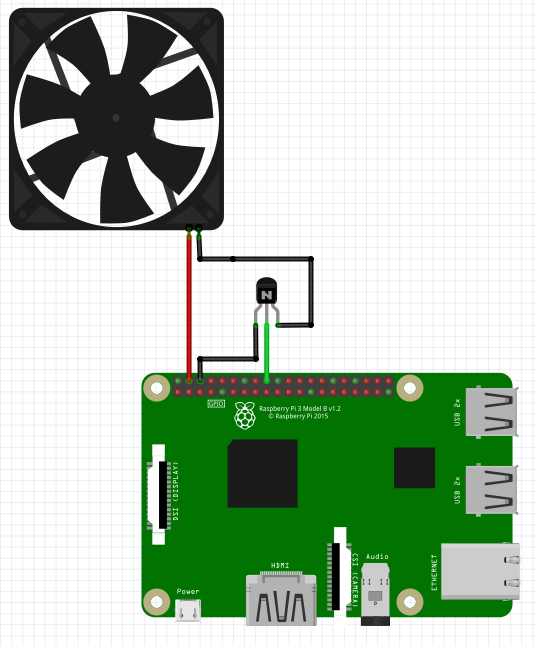

# FKODI
 A deamon for KODI on Raspberry (fan, button)

 * Temperature regulation with FAN
 * reboot button (coming soon)

# Wiring



# Dependencys

Rpi.GPIO (python)

# Installation

```
sudo mkdir /opt/FKODI
sudo cp rpi_fan.* /opt/FKODI
sudo nano /opt/FKODI/rpi_fan.py   #to modify params
sudo systemctl enable /opt/FKODI/rpi_fan.service
sudo systemctl start rpi_fan.service
```
